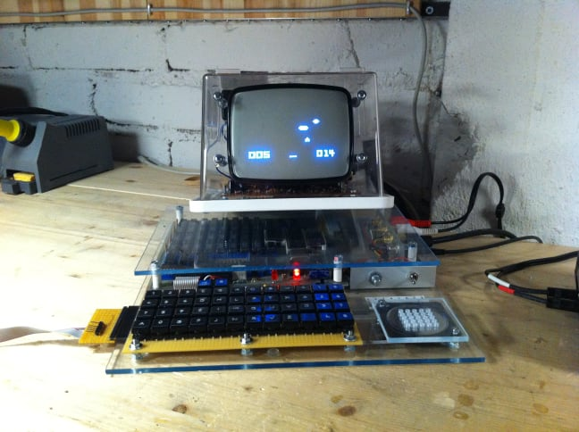
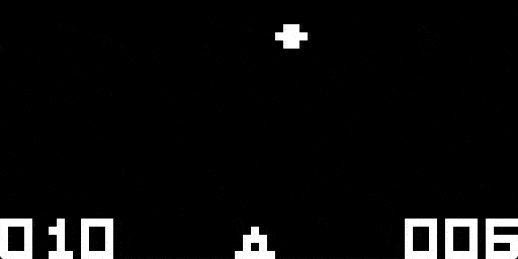

> a CHIP-8 emulator written in Go


- [About](#about)
- [Instructions](#instructions)
- [Controls](#controls)
- [Games](#games)

## About

CHIP-8 is an interpreted programming language originally designed for hobby computers in the mid-70s.



> Telmac 1800 running CHIP-8 game Space Intercept (Joseph Weisbecker, 1978)

## Instructions

Download chip8go and run the program. A file dialog will appear for you to choose a `.ch8` game. Several quality public domain games are included in the `games` folder.

## Controls

`Enter` resets the game

Game buttons are on the left side of your keyboard:

```ascii
1 2 3 4
Q W E R
A S D F
Z X C V
```

Each corresponding to keys on the original CHIP-8 layout:

```ascii
C D E F
8 9 A B
4 5 6 7
0 1 2 3
```

## Games

### Brix


- `Q` move left
- `E` move right

### Pong 2


#### Player 1

- `1` Move up
- `Q` Move down

#### Player 2

- `4` Move up
- `R` Move down

### Tetris


- `W` Move left
- `E` Move right
- `Q` Rotate
- `A` Fast drop

### UFO



- `Q` Shoot left
- `W` Shoot up
- `E` Shoot right
